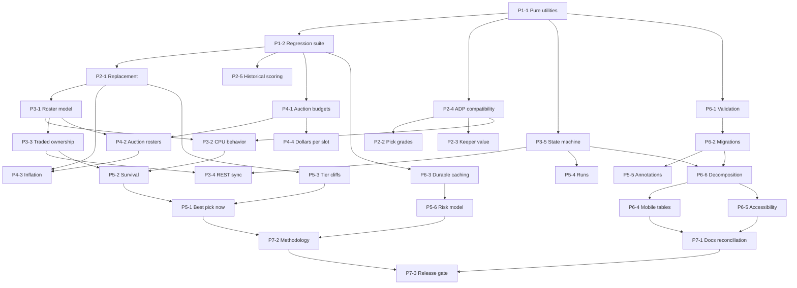

# DraftBoard Implementation Roadmap

## Current-state assessment

DraftBoard is a functional Next.js 16 application with three user-facing modes: a configurable cheat sheet, a snake mock/live draft board, and an auction tracker. The core scoring and VOR calculations live in [`lib/scoring.ts`](lib/scoring.ts) and [`lib/vbd.ts`](lib/vbd.ts); player data is assembled by [`app/api/players/route.ts`](app/api/players/route.ts); and most interaction logic currently lives in the large client components [`components/DraftBoard.tsx`](components/DraftBoard.tsx), [`components/MockDraft.tsx`](components/MockDraft.tsx), and [`components/AuctionDraft.tsx`](components/AuctionDraft.tsx).

The product has useful breadth, but its most consequential decisions are not protected by automated tests. Several displayed values also mix incompatible inputs or use the wrong reference point:

- Skill-position replacement points use the first player after the allocated pool, while K/DEF use the last starter.
- Draft grades compare ADP with overall rank instead of the actual pick paid; keeper analysis uses the user's slot in every round instead of snake order.
- Sleeper format-specific ADP is averaged with ESPN PPR ADP in all formats.
- The 2025 comparison is fetched as precomputed PPR points rather than scored with the active league settings.
- CPU teams draft from noisy ADP without tracking their rosters; traded-pick ownership is shown on the grid but does not drive who owns a pick.
- Live sync relies on an explicitly unverified WebSocket host, topic, and event shape, even though the documented Sleeper REST endpoints are already used for imports.
- Auction values allocate all remaining cash to positive VOR and accept wins that can exceed a team's spendable budget or roster capacity.
- Persistence uses unversioned `localStorage`/`sessionStorage` payloads, and API freshness relies primarily on process-local memos even though serverless instances do not share durable memory.
- Dense tables have inconsistent horizontal scrolling, clickable headers/rows are not consistently keyboard controls, and the largest component is approximately 1,800 lines.
- [`README.md`](README.md) and [`HANDOFF.md`](HANDOFF.md) describe an older, narrower product and contradict current K/DEF, bye-week, mock-draft, auction, and data-source behavior.

This roadmap is correctness-first: it protects the current behavior with tests, fixes misleading calculations, establishes legal draft invariants, then layers decision support and UX improvements on top.

## Roadmap goals

1. Make every recommendation and valuation reproducible, format-correct, and explainable.
2. Guarantee legal snake and auction draft states, including keepers and traded picks.
3. Make simulation behavior roster-valid while retaining realistic uncertainty.
4. Preserve user data safely as schemas evolve and make upstream data delivery resilient.
5. Establish an objective release gate without performing deployment in this roadmap.

## Prioritization principles

1. **Protect before changing.** Extract pure logic and establish regression tests before correcting formulas.
2. **Correctness before sophistication.** Legal budgets, ownership, roster eligibility, and compatible data sources precede predictive features.
3. **One canonical model.** Scoring, replacement, snake ownership, roster assignment, and persistence schemas must each have a single shared implementation.
4. **Explain every recommendation.** A user should be able to see which inputs and tradeoffs produced a suggestion.
5. **Degrade explicitly.** Missing ESPN, Sleeper, historical, or sync data must produce a labeled fallback rather than a silent blend or stale state.
6. **Measure outcomes at boundaries.** Acceptance tests should assert user-visible invariants, not implementation details.

## Key decisions

- **Replacement semantics:** “replacement” means the **first undrafted player** at a position after all modeled starter/bench allocations. The baseline rank and baseline points must refer to that same player.
- **ADP authority:** format-specific Sleeper ADP remains authoritative outside PPR. ESPN ADP is a PPR-only supplement and must never be blended into Half-PPR, Standard, TE-premium-with-non-PPR-base, or Superflex recommendations.
- **Live synchronization:** documented REST polling is the supported live-sync path until Sleeper publishes an official streaming protocol. The unverified WebSocket path is removed, not retained as a hidden fallback.
- **Historical scoring:** stored raw historical stats are scored through the active `ScoringConfig`; a precomputed PPR total is not a universal comparison value.
- **Auction legality:** every team must retain at least $1 for each open roster slot, and no confirmed bid may exceed the resulting maximum legal bid.

## Effort legend

| Effort | Meaning |
| --- | --- |
| **S** | Localized change, usually one subsystem and limited new test fixtures. |
| **M** | Multi-file change or a new shared abstraction with meaningful edge-case coverage. |
| **L** | Cross-cutting model or feature requiring new algorithms, UI, fixtures, and end-to-end verification. |

## Definition of done

An item is done only when its implementation, unit tests, user-visible error/fallback states, and relevant documentation are complete; acceptance criteria below pass; no unrelated behavior regresses; and `npm run lint`, `npm run build`, and the repository's unit-test command all pass. Shared domain rules must be implemented once in a pure/testable module and consumed by every applicable mode. Approximate or probabilistic outputs must show their inputs and limitations.

## Phase 1 — Test Foundation

### P1-1 — Extract deterministic draft-domain utilities

- **Rationale:** Snake math, roster assignment, grading, keeper valuation, traded ownership, and auction calculations are embedded in client components, making them hard to test and easy to implement inconsistently.
- **Implementation approach:** Introduce focused pure modules under `lib/` for snake order/ownership, draft state and roster assignment, market-value selection, auction constraints, and persistence parsing. Move logic without intentionally changing results. Keep React components responsible for orchestration and rendering.
- **Affected subsystem:** [`components/MockDraft.tsx`](components/MockDraft.tsx), [`components/DraftBoardGrid.tsx`](components/DraftBoardGrid.tsx), [`components/AuctionDraft.tsx`](components/AuctionDraft.tsx), [`components/useLocalStorage.ts`](components/useLocalStorage.ts), new `lib/draft-*` modules.
- **Dependencies:** None.
- **Effort:** **M**
- **Deliverables:** Pure exported functions, typed inputs/outputs, deterministic random-number injection points, and fixture builders for players, leagues, picks, and auctions.
- **Acceptance criteria:** Existing user-visible behavior is unchanged; extracted functions have no browser/React dependency; snake cell-to-pick and pick-to-slot functions round-trip for odd/even rounds and 2–32 teams.
- **Non-goals:** Formula corrections, UI redesign, or new recommendation features.

### P1-2 — Establish the automated regression suite

- **Rationale:** The repository currently has lint/build scripts but no unit-test script or committed test suite for its core product logic.
- **Implementation approach:** Add a TypeScript-compatible unit-test runner and table-driven fixtures. Cover scoring (including TE premium, two-point plays, K/DEF fallback), VOR/VOLS/VORP and flex/superflex allocation, snake order, keepers, traded-pick ownership, auction budget math, and persistence migrations. Add a small route/data-normalization contract suite with upstream requests mocked.
- **Affected subsystem:** [`package.json`](package.json), `lib/`, `app/api/players/`, `components/useLocalStorage.ts`, new test configuration and test files.
- **Dependencies:** P1-1.
- **Effort:** **L**
- **Deliverables:** `npm test` (or equivalently documented command), deterministic fixtures, coverage reporting, and regression cases for every Phase 2–4 correctness bug.
- **Acceptance criteria:** Tests fail against deliberately reintroduced off-by-one replacement, even-round keeper, traded-owner, overspend, and incompatible-ADP defects; tests run offline; CI-friendly test command exits nonzero on failure.
- **Non-goals:** Browser visual regression coverage or a numeric coverage target that rewards testing render boilerplate.

## Phase 2 — Ranking Correctness

### P2-1 — Standardize first-undrafted replacement semantics

- **Rationale:** `computeSkillBaselines()` uses array index `started`, but K/DEF use `teams - 1`; the displayed rank can therefore identify a different player from the points baseline.
- **Implementation approach:** Define a canonical allocation count and zero-based first-undrafted index. Return both baseline rank and points from the same selected player for every position, including exhausted pools. Update labels and tests so VOLS and VORP use identical semantics.
- **Affected subsystem:** [`lib/vbd.ts`](lib/vbd.ts), replacement summary/line in [`components/DraftBoard.tsx`](components/DraftBoard.tsx).
- **Dependencies:** P1-2.
- **Effort:** **M**
- **Deliverables:** Canonical baseline helper, corrected K/DEF behavior, and boundary fixtures for empty, exact-size, and undersized pools.
- **Acceptance criteria:** In a 12-team one-starter position, replacement points come from player 13 and the UI identifies that same player boundary; negative VOR begins below the replacement player according to the documented convention; all positions pass the same invariant tests.
- **Non-goals:** Changing how many starters/bench players VOLS or VORP allocates.

### P2-2 — Grade picks against acquisition cost

- **Rationale:** The completed mock grade currently calculates `average ADP - overall rank`, which grades the ranking model rather than whether the manager selected a player at good value.
- **Implementation approach:** Calculate pick value as compatible market ADP minus actual `pickNumber`, aggregate with a documented weighting/threshold scheme, and show the acquisition pick, market reference, and contribution for each graded player. Exclude keepers or grade them under the separate keeper model.
- **Affected subsystem:** Draft-grade logic and panel in [`components/MockDraft.tsx`](components/MockDraft.tsx), shared market-value utility.
- **Dependencies:** P1-1, P2-4.
- **Effort:** **S**
- **Deliverables:** Corrected formula, transparent grade breakdown, missing-ADP behavior, and grade threshold tests.
- **Acceptance criteria:** A player with ADP 40 selected at pick 25 displays +15 pick value; the same player selected at 55 displays -15; letter grades change from pick cost, not from `overallRank` changes alone.
- **Non-goals:** Predicting future player performance or using the grade as a roster-quality score.

### P2-3 — Value keeper costs in true snake order

- **Rationale:** Keeper cost currently uses `(round - 1) * teams + userSlot`, which is wrong in even rounds and ignores the keeper's selected team slot.
- **Implementation approach:** Use the canonical snake helper with each keeper's `round` and `teamSlot`; apply the compatible ADP policy; clearly distinguish draft-pick surplus from projected fantasy value.
- **Affected subsystem:** Keeper analysis/setup in [`components/MockDraft.tsx`](components/MockDraft.tsx), snake utility.
- **Dependencies:** P1-1, P2-4.
- **Effort:** **S**
- **Deliverables:** Correct pick-equivalent calculation and odd/even-round keeper fixtures.
- **Acceptance criteria:** In a 12-team draft, slot 3 costs pick 3 in round 1 and pick 22 in round 2; changing a keeper's team slot updates its cost; verdict thresholds operate on the corrected surplus.
- **Non-goals:** Modeling escalating multi-year keeper contracts or future draft-pick inflation.

### P2-4 — Enforce format-compatible ADP selection

- **Rationale:** Cheat-sheet value, trend, keeper analysis, draft grades, CSV export, and mock sorting currently average ESPN PPR with Sleeper ADP even when the active format is non-PPR or Superflex.
- **Implementation approach:** Centralize a market-reference function that returns source values, compatibility, consensus, and display label. Use Sleeper's active format as authoritative; in PPR only, optionally supplement it with ESPN PPR. Apply the helper everywhere instead of constructing local arrays.
- **Affected subsystem:** [`lib/presets.ts`](lib/presets.ts), [`components/DraftBoard.tsx`](components/DraftBoard.tsx), [`components/MockDraft.tsx`](components/MockDraft.tsx), CSV export and ADP snapshots.
- **Dependencies:** P1-1.
- **Effort:** **M**
- **Deliverables:** One compatibility-aware selector, source badges/labels, and missing-source fallbacks.
- **Acceptance criteria:** Standard/Half/Superflex values are unchanged when ESPN PPR changes; PPR can show Sleeper plus ESPN and labels the blend; every market-derived feature uses the same result.
- **Non-goals:** Scraping additional ADP providers or converting PPR ADP into synthetic non-PPR ADP.

### P2-5 — Score historical stats with active settings

- **Rationale:** `fetch2025ActualPts()` stores Sleeper's `pts_ppr`/`pts_std`, so the “2025” column does not honor custom scoring, Half-PPR, TE premium, or touchdown/interception settings.
- **Implementation approach:** Normalize the same raw stat fields for historical records as projections, attach them as a separate typed snapshot, and run `fantasyPoints()` with the active scoring config. Label unavailable K/DEF or unsupported historical categories explicitly.
- **Affected subsystem:** [`lib/sleeper.ts`](lib/sleeper.ts), [`lib/types.ts`](lib/types.ts), [`lib/scoring.ts`](lib/scoring.ts), [`app/api/players/route.ts`](app/api/players/route.ts), historical column in [`components/DraftBoard.tsx`](components/DraftBoard.tsx).
- **Dependencies:** P1-2.
- **Effort:** **M**
- **Deliverables:** Raw historical-stat normalization, active-scoring calculation, data contract update, and custom-scoring fixtures.
- **Acceptance criteria:** Changing reception or passing-TD scoring changes historical points by the expected arithmetic; PPR totals match the supported raw-stat calculation within documented source precision; unavailable data shows “unavailable,” not zero.
- **Non-goals:** Retrospective weekly lineup simulation or importing multiple historical seasons.

## Phase 3 — Draft Simulation

### P3-1 — Build one roster-valid team model

- **Rationale:** Imported user rosters can be displayed, but CPU teams do not maintain equivalent slot assignments and manual/live picks can produce rosters that are hard to validate.
- **Implementation approach:** Represent each team's picks and derived slot assignment through a shared eligibility engine supporting dedicated, FLEX, SUPER_FLEX, K, DEF, and bench slots. Recompute valid assignments after every event and expose remaining needs/capacity.
- **Affected subsystem:** Draft-domain modules, [`components/MockDraft.tsx`](components/MockDraft.tsx), Sleeper roster-position mapping.
- **Dependencies:** P1-1, P2-1.
- **Effort:** **M**
- **Deliverables:** Team roster state, eligibility/assignment API, and fixtures for flex/superflex edge cases.
- **Acceptance criteria:** Every simulated team can be assigned to its configured roster at completion; no team exceeds total slots; flex-eligible players are assigned without stranding a dedicated starter when a valid arrangement exists.
- **Non-goals:** Optimizing starting lineups by weekly projections.

### P3-2 — Make CPU picks need-aware with realistic variance

- **Rationale:** The CPU currently selects the lowest ADP plus uniform ±4 jitter and can stockpile one position while leaving required starters empty.
- **Implementation approach:** Score candidates using compatible ADP, remaining roster needs, positional scarcity/tier context, round/bench phase, and bounded seeded randomness. Reject candidates that make a legal completed roster impossible. Expose simulation seed/difficulty only if needed for reproducibility.
- **Affected subsystem:** CPU auto-pick effect in [`components/MockDraft.tsx`](components/MockDraft.tsx), roster model, ranking/market utilities.
- **Dependencies:** P2-4, P3-1.
- **Effort:** **M**
- **Deliverables:** Candidate scoring function, seeded variance, roster-feasibility guard, and multi-seed simulations.
- **Acceptance criteria:** Across a deterministic test matrix and a documented multi-seed sample, 100% of CPU teams finish roster-valid; repeated drafts vary meaningfully without implausible early K/DEF or impossible starter deficits; the same seed reproduces the same draft.
- **Non-goals:** Claiming to emulate a specific human manager or training an ML drafting model.

### P3-3 — Apply traded-pick ownership to draft turns

- **Rationale:** Imported trades currently render “→Tn” in empty grid cells, but `currentTeamSlot` still derives only from the original snake slot, so recommendations, roster attribution, and user turns can be wrong.
- **Implementation approach:** Resolve `(round, originalSlot)` through a canonical ownership map before each pick. Store both original slot and current owner where useful; use the owner for turn control, roster assignment, CPU decisions, logs, exports, and user highlighting.
- **Affected subsystem:** [`components/MockDraft.tsx`](components/MockDraft.tsx), [`components/DraftBoardGrid.tsx`](components/DraftBoardGrid.tsx), draft ownership utility.
- **Dependencies:** P1-1, P3-1.
- **Effort:** **M**
- **Deliverables:** Ownership resolver, trade-aware current turn, and imported-trade fixtures.
- **Acceptance criteria:** A traded pick is made by and added to the current owner's roster while retaining its original board cell; user-turn status follows ownership; exports identify the current owner; chained/duplicate records have a deterministic documented resolution.
- **Non-goals:** Creating or editing Sleeper trades from DraftBoard.

### P3-4 — Replace unverified WebSockets with REST live sync

- **Rationale:** The current WebSocket implementation documents its own host, protocol, topic, event names, and payload as guesses; presenting it as live creates false reliability.
- **Implementation approach:** Remove the WebSocket mode internals and poll Sleeper's documented draft/picks/traded-picks REST endpoints on a bounded interval while a draft is active and the page is visible. Reconcile snapshots idempotently, back off on errors, allow manual refresh, and show last-success time/status.
- **Affected subsystem:** Live mode in [`components/MockDraft.tsx`](components/MockDraft.tsx), Sleeper draft API adapter.
- **Dependencies:** P1-1, P3-3, P3-5.
- **Effort:** **M**
- **Deliverables:** REST poller, reconciliation rules, visibility/backoff handling, status UI, and mocked polling tests.
- **Acceptance criteria:** New, corrected, and removed picks converge to the REST snapshot without duplicates; polling stops on completion/unmount/hidden-page policy; transient failure preserves the last good draft and reports staleness; no `WebSocket` or guessed streaming endpoint remains.
- **Non-goals:** Sub-second updates or reverse-engineering an unofficial protocol.

### P3-5 — Formalize draft state transitions

- **Rationale:** `started`, import state, picks, sync status, setup, and completion are independent React states, allowing ambiguous combinations and difficult recovery.
- **Implementation approach:** Define an explicit draft state machine/reducer for setup, ready, running, syncing, paused/stale, complete, and reset states. Model import/poll/pick/keeper/reset as typed events with guards and invariants; persist only validated snapshots.
- **Affected subsystem:** [`components/MockDraft.tsx`](components/MockDraft.tsx), draft persistence, new reducer/state module.
- **Dependencies:** P1-1.
- **Effort:** **M**
- **Deliverables:** State/event types, reducer, transition table, illegal-event behavior, and recovery tests.
- **Acceptance criteria:** Illegal transitions are rejected or no-op with a visible reason; reset returns one known initial state; restored running/complete drafts resume correctly; duplicate click/poll events cannot claim the same pick twice.
- **Non-goals:** A server-side collaborative draft database.

## Phase 4 — Auction Planning

### P4-1 — Reserve minimum dollars and enforce maximum bids

- **Rationale:** Suggested bids allocate the entire remaining budget, and confirmed wins may drive a team below the cash needed to complete its roster or below zero.
- **Implementation approach:** For each team compute `openSlots`, `reservedMinimum = openSlots × $1`, and `maxBid = remainingBudget - (openSlots - 1) × $1`. Clamp suggestions to the nominated winner's legal range and block invalid confirmations with an inline explanation.
- **Affected subsystem:** Auction math and nomination form in [`components/AuctionDraft.tsx`](components/AuctionDraft.tsx), shared auction utility.
- **Dependencies:** P1-1, P1-2.
- **Effort:** **M**
- **Deliverables:** Spendable/reserved/max-bid calculations, validation UI, and boundary tests.
- **Acceptance criteria:** No accepted sequence can produce a negative budget or leave insufficient $1 minimum bids; a team with $10 and three open slots has an $8 maximum bid; suggested bids never exceed the selected team's maximum.
- **Non-goals:** Supporting zero-dollar minimum leagues in the first implementation.

### P4-2 — Enforce auction roster capacity and eligibility

- **Rationale:** Auction teams currently accept unlimited players with no position or total-roster constraints.
- **Implementation approach:** Reuse the roster assignment engine for each auction team, block wins after total capacity, surface remaining legal slots, and warn/block a purchase that makes completing required positions impossible under the configured rules.
- **Affected subsystem:** [`components/AuctionDraft.tsx`](components/AuctionDraft.tsx), roster model from P3-1.
- **Dependencies:** P3-1, P4-1.
- **Effort:** **M**
- **Deliverables:** Auction roster assignment/capacity UI and legal-purchase validator.
- **Acceptance criteria:** A team cannot exceed configured roster size; each accepted roster remains completable; FLEX/SUPER_FLEX eligibility matches snake mode; completed teams are roster-valid.
- **Non-goals:** Automated auction opponents or nomination-order simulation.

### P4-3 — Calculate team-specific auction inflation

- **Rationale:** One global `positiveVorPool` and total budget ignore how much each team can actually spend and which roster slots it still needs, producing suggestions that are neither team-specific nor budget-safe.
- **Implementation approach:** Establish baseline dollar values from value-above-replacement after reserving minimum dollars. For each prospective winner, recalculate the eligible remaining value pool, spendable dollars, roster needs, and market inflation ratio; label the formula and fallback when the pool is exhausted.
- **Affected subsystem:** Auction valuation modules and [`components/AuctionDraft.tsx`](components/AuctionDraft.tsx).
- **Dependencies:** P2-1, P4-1, P4-2.
- **Effort:** **L**
- **Deliverables:** Baseline price model, per-team inflation/adjusted value, explanation details, and scenario fixtures.
- **Acceptance criteria:** Two teams with different budgets or open positions receive different legal guidance for the same nominee; over/under-spending changes inflation in the expected direction; all suggested values reconcile to spendable league dollars within rounding rules.
- **Non-goals:** Predicting human bid behavior or guaranteeing a clearing price.

### P4-4 — Expose dollars-per-slot guidance

- **Rationale:** A remaining budget alone does not tell a manager whether it is concentrated enough to pursue stars or must be spread across many roster spots.
- **Implementation approach:** Display remaining budget, reserved minimum, spendable above minimum, open slots, average dollars per open slot, and maximum bid for each team, derived from the canonical auction model.
- **Affected subsystem:** Auction roster cards and nomination panel in [`components/AuctionDraft.tsx`](components/AuctionDraft.tsx).
- **Dependencies:** P4-1, P4-2.
- **Effort:** **S**
- **Deliverables:** Compact team budget guidance with accessible labels/tooltips.
- **Acceptance criteria:** Values update immediately after wins/reset; arithmetic matches the auction utility; overspend-risk states are impossible rather than merely colored red.
- **Non-goals:** A separate auction strategy dashboard.

## Phase 5 — Decision Support

### P5-1 — Add an explainable “best pick now” score

- **Rationale:** The current suggestion chooses the highest-VOR eligible player and cannot explain tradeoffs among need, value, market timing, and scarcity.
- **Implementation approach:** Create a normalized composite using projected/VOR value, roster fit, tier scarcity, compatible ADP value, and next-pick survival. Return factor contributions and confidence/data-quality flags; keep weights configured and tested rather than embedded in JSX.
- **Affected subsystem:** New recommendation module, [`components/MockDraft.tsx`](components/MockDraft.tsx), ranking and roster utilities.
- **Dependencies:** P2-4, P3-1, P5-2, P5-3.
- **Effort:** **L**
- **Deliverables:** Ranked recommendations, factor breakdown, “why this player” UI, and sensitivity fixtures.
- **Acceptance criteria:** Recommendations are roster-legal; every displayed score decomposes into labeled factors that sum to the total; missing ADP/risk data lowers confidence without silently becoming zero value.
- **Non-goals:** Presenting the score as a guaranteed optimal pick.

### P5-2 — Estimate player survival to the next owned pick

- **Rationale:** Managers need to know whether a player can wait, especially with traded picks; raw ADP does not directly answer that question.
- **Implementation approach:** Determine the user's next owned pick, then estimate survival from compatible ADP uncertainty and the number/needs of intervening teams. Calibrate a transparent initial distribution from documented assumptions and show ranges/confidence rather than false precision.
- **Affected subsystem:** Draft ownership, CPU/market model, recommendation UI.
- **Dependencies:** P2-4, P3-2, P3-3.
- **Effort:** **L**
- **Deliverables:** Next-owned-pick resolver, survival estimator, calibration fixtures, and explanation copy.
- **Acceptance criteria:** Traded picks change the horizon correctly; survival probability decreases as the next pick moves later or market ADP moves earlier; deterministic inputs reproduce results; UI labels the estimate and assumptions.
- **Non-goals:** Claiming bookmaker-grade probabilities or using proprietary live draft-room data.

### P5-3 — Surface tier cliffs

- **Rationale:** Tiers are displayed, but the app does not quantify the cost of waiting past the end of a tier.
- **Implementation approach:** Calculate the projected/VOR drop from each player to the next available same-position tier and flag material cliffs using tested thresholds. Feed the result into recommendation explanations.
- **Affected subsystem:** [`lib/vbd.ts`](lib/vbd.ts), cheat-sheet and mock-draft UI, recommendation module.
- **Dependencies:** P2-1.
- **Effort:** **M**
- **Deliverables:** Tier-cliff metric, threshold policy, and visual indicator.
- **Acceptance criteria:** Flags correspond to actual next-tier drops; filtering/drafted players recomputes the available cliff; displayed point/VOR deltas match player data.
- **Non-goals:** Replacing the existing tier-generation algorithm in this item.

### P5-4 — Detect positional runs

- **Rationale:** Position counts show cumulative availability but do not identify recent bursts that may change near-term scarcity.
- **Implementation approach:** Analyze a configurable recent-pick window against earlier/base position rates; label emerging/active runs and show how many players at the position were selected. Treat the signal as context, not an automatic reason to chase.
- **Affected subsystem:** Draft event selectors and [`components/MockDraft.tsx`](components/MockDraft.tsx).
- **Dependencies:** P3-5.
- **Effort:** **M**
- **Deliverables:** Run detector, thresholds, compact status UI, and event-sequence tests.
- **Acceptance criteria:** Known pick sequences trigger and clear runs at documented thresholds; keepers do not masquerade as live runs; explanations show window and count.
- **Non-goals:** Automatically overriding the recommendation solely because of a run.

### P5-5 — Persist targets, avoids, and notes

- **Rationale:** The mock watchlist is in-memory only, and there is no durable avoid or free-form research note shared across modes.
- **Implementation approach:** Create a versioned player-annotation store keyed by season/player ID with target, avoid, and note fields. Use it in cheat-sheet and draft views, define target/avoid conflict behavior, and include annotations in export where appropriate.
- **Affected subsystem:** Draft/cheat-sheet rows, persistence layer, CSV/export.
- **Dependencies:** P6-2.
- **Effort:** **M**
- **Deliverables:** Annotation model/editor, filters/badges, persistence, and migration tests.
- **Acceptance criteria:** Annotations survive reload/tab changes, remain season-scoped, are visible in both relevant modes, and malformed/old records migrate without losing valid notes.
- **Non-goals:** Cloud accounts, cross-device sync, or collaborative notes.

### P5-6 — Replace the heuristic risk badge with an evidence-based model

- **Rationale:** Current risk is a 1–10 additive heuristic based mostly on injury text, rookie status, and age; the number implies precision without validation or explanation.
- **Implementation approach:** Define supported evidence categories (availability/injury, role uncertainty, experience/age, projection disagreement or volatility where data exists), normalize them, document weights and missing-data handling, and show factor-level reasons plus confidence. Validate monotonic behavior with fixtures and label the output as an estimate.
- **Affected subsystem:** Risk logic in [`components/DraftBoard.tsx`](components/DraftBoard.tsx), normalized player/data types, recommendation module.
- **Dependencies:** P2-4, P6-3 for any additional durable source.
- **Effort:** **L**
- **Deliverables:** Shared risk model, evidence schema, explanation UI, source-quality states, and tests.
- **Acceptance criteria:** The same inputs yield the same score; severe confirmed unavailability cannot score safer than a healthy otherwise-equivalent player; missing evidence is labeled unknown rather than safe; each score lists its contributing evidence.
- **Non-goals:** Medical advice, injury diagnosis, or invented data when reliable evidence is absent.

## Phase 6 — Reliability and UX

### P6-1 — Validate all configuration inputs

- **Rationale:** Numeric fields write `Number(...)` directly and allow empty, negative, fractional, or extreme values that can produce invalid arrays, baselines, and budgets.
- **Implementation approach:** Define schemas and domain bounds for scoring, roster, draft, and auction setup; validate on input/import/restore; preserve editable draft text where needed; show inline errors; clamp only where the correction is unambiguous.
- **Affected subsystem:** [`components/ConfigPanel.tsx`](components/ConfigPanel.tsx), [`components/LeagueImport.tsx`](components/LeagueImport.tsx), mock/auction setup, persistence parsers.
- **Dependencies:** P1-1.
- **Effort:** **M**
- **Deliverables:** Shared validation schemas, accessible error messages, and invalid-input/import tests.
- **Acceptance criteria:** Teams/slots/rounds are bounded integers, budgets and required counts are legal, scoring values are finite, invalid saved/imported data cannot crash ranking or draft setup, and the user sees how to correct an error.
- **Non-goals:** Preventing unusual but mathematically valid custom scoring systems.

### P6-2 — Introduce versioned storage migrations

- **Rationale:** Storage payloads are unversioned, parse with unchecked casts, and silently ignore malformed data; future shape changes can corrupt or discard user state.
- **Implementation approach:** Store envelopes containing schema version, season where relevant, and validated data. Implement sequential pure migrations, quarantine/reset only irrecoverable records, and coordinate local/session keys through one persistence adapter.
- **Affected subsystem:** [`components/useLocalStorage.ts`](components/useLocalStorage.ts), draft session persistence, auction persistence, ADP snapshot and annotations.
- **Dependencies:** P1-1, P6-1.
- **Effort:** **M**
- **Deliverables:** Storage registry, schemas, migrations from every current key, recovery notices, and migration fixtures.
- **Acceptance criteria:** Every current `ffdp.*` payload migrates without losing valid data; future/invalid versions fail safely; migrations are idempotent; season-specific data cannot leak into a new season unnoticed.
- **Non-goals:** Server persistence or user authentication.

### P6-3 — Add durable API and CDN caching

- **Rationale:** Sleeper/ESPN/stats fetches use `cache: "no-store"` plus process-local 12-hour memos. In serverless deployments those memos are isolated and ephemeral; Next.js 16 route handlers are not cached by default, so `revalidate` alone does not guarantee a shared cached response.
- **Implementation approach:** Following the bundled Next 16 route-handler/cache guidance, move normalized upstream results to a durable shared cache (or supported remote cache), define explicit TTL/stale behavior and cache keys by season/source, and return CDN-compatible cache headers for the public player response. Preserve partial-source status and stale-on-upstream-error behavior.
- **Affected subsystem:** [`lib/sleeper.ts`](lib/sleeper.ts), [`lib/espn.ts`](lib/espn.ts), [`app/api/players/route.ts`](app/api/players/route.ts), deployment configuration.
- **Dependencies:** P1-2.
- **Effort:** **M**
- **Deliverables:** Durable cache adapter, explicit route/CDN policy, observability fields, failure fixtures, and operational documentation.
- **Acceptance criteria:** Separate instances reuse the same normalized cache entry; response headers express intended shared TTL/staleness; upstream failure can serve a labeled last-good payload within policy; cache keys prevent cross-season contamination.
- **Non-goals:** Selecting or executing a production deployment provider in this roadmap.

### P6-4 — Make dense tables usable on mobile

- **Rationale:** The draft grid scrolls horizontally, but the cheat-sheet, mock player table, and auction table use `overflow-hidden`, causing dense columns to compress or clip on small screens.
- **Implementation approach:** Add deliberate horizontal scroll containers, minimum table widths, sticky identity/action columns where practical, scroll affordances, and responsive column prioritization without removing access to data.
- **Affected subsystem:** [`components/DraftBoard.tsx`](components/DraftBoard.tsx), [`components/MockDraft.tsx`](components/MockDraft.tsx), [`components/AuctionDraft.tsx`](components/AuctionDraft.tsx), global styles.
- **Dependencies:** P6-6 where decomposition changes table ownership.
- **Effort:** **S**
- **Deliverables:** Responsive table wrappers and viewport-level UI tests/checklist.
- **Acceptance criteria:** At 320 CSS pixels, every table can reach all columns/actions without page-level horizontal overflow; focus remains visible while scrolling; desktop layout does not regress.
- **Non-goals:** Replacing tables with card-only mobile views.

### P6-5 — Complete keyboard and semantic accessibility

- **Rationale:** Sortable `<th>` elements and clickable player rows are mouse-only, several icon controls lack names, and status changes are not consistently announced.
- **Implementation approach:** Use real buttons inside headers/cells, add `aria-sort`, accessible names, focus styles, keyboard row actions, labeled form errors, and polite live regions for draft/sync results. Preserve table semantics and avoid nested interactive click conflicts.
- **Affected subsystem:** All interactive components, especially [`components/DraftBoard.tsx`](components/DraftBoard.tsx) and [`components/MockDraft.tsx`](components/MockDraft.tsx).
- **Dependencies:** P6-6.
- **Effort:** **M**
- **Deliverables:** Semantic control refactor, automated accessibility checks, and manual keyboard test script.
- **Acceptance criteria:** All actions are reachable/operable with keyboard alone; sort state is programmatically exposed; focus order/visibility is stable; automated checks have no serious violations in each mode.
- **Non-goals:** A full external WCAG certification.

### P6-6 — Decompose large client components by domain

- **Rationale:** `MockDraft.tsx` combines import, persistence, sync, simulation, analytics, export, and multiple views in one large component; the other mode components also duplicate market/table logic.
- **Implementation approach:** After pure logic is extracted, split stateful controllers/hooks from presentational setup, board, player table, roster, grade, and sync panels. Share small domain components only where behavior truly matches; keep state ownership explicit to avoid prop/state duplication.
- **Affected subsystem:** [`components/MockDraft.tsx`](components/MockDraft.tsx), [`components/DraftBoard.tsx`](components/DraftBoard.tsx), [`components/AuctionDraft.tsx`](components/AuctionDraft.tsx), shared components/hooks.
- **Dependencies:** P1-1, P3-5, P6-2.
- **Effort:** **L**
- **Deliverables:** Domain-oriented component tree, focused hooks/controllers, and unchanged behavior verified by existing tests.
- **Acceptance criteria:** No extracted component owns a second competing source of truth; domain computations remain outside render components; lint/build/tests pass; the major workflows can be tested without mounting the entire application.
- **Non-goals:** Introducing a global state library solely to reduce prop passing or redesigning the visual language.

## Phase 7 — Documentation and Release Gate

### P7-1 — Reconcile README and handoff documentation

- **Rationale:** Existing documentation still describes mock/auction/K/DEF/bye features as absent, lists an old path/status, and omits current data sources and storage keys.
- **Implementation approach:** Audit the finished application, update [`README.md`](README.md) for users/contributors, and either refresh [`HANDOFF.md`](HANDOFF.md) as a current operational handoff or clearly archive/replace it. Remove contradictory claims and verify every referenced path/command.
- **Affected subsystem:** Project documentation only.
- **Dependencies:** Phases 2–6.
- **Effort:** **S**
- **Deliverables:** Current feature/status/architecture docs and verified setup/test commands.
- **Acceptance criteria:** README and handoff agree on scope, season, sources, caching, tests, and supported sync; every link/path exists; no completed feature remains listed as “not built.”
- **Non-goals:** Marketing copy, deployment execution, or a historical changelog reconstruction.

### P7-2 — Document methodology and known approximations

- **Rationale:** VOR, tiers, ADP consensus, CPU variance, auction inflation, survival, recommendations, and risk all influence decisions and must not appear more authoritative than their evidence.
- **Implementation approach:** Add a methodology document linked from the product docs. Define inputs, formulas, compatibility rules, fallbacks, calibration, and limitations for each model; include worked examples for replacement, snake keeper cost, pick grade, and max auction bid.
- **Affected subsystem:** Documentation and in-product help links.
- **Dependencies:** P2-1 through P5-6.
- **Effort:** **M**
- **Deliverables:** Methodology/limitations reference and concise in-product explanations.
- **Acceptance criteria:** A reviewer can reproduce each worked value from documented inputs; approximations and missing-data behavior are explicit; key decisions in this roadmap appear verbatim or equivalently in user-facing docs.
- **Non-goals:** Academic validation claims or publication of unsupported accuracy metrics.

### P7-3 — Enforce the release-readiness gate

- **Rationale:** Lint/build alone do not verify domain regressions or whether live player sources still produce usable data.
- **Implementation approach:** Add one documented release command/workflow that runs clean-install assumptions as appropriate, lint, unit tests, production build, and a runtime `/api/players` source check. Assert minimum contract quality (season, count, unique IDs, positions, source flags) without making optional ESPN/history outages fatal when graceful degradation works.
- **Affected subsystem:** [`package.json`](package.json), test/release scripts, contributor documentation.
- **Dependencies:** P1-2, P6-3, P7-1, P7-2.
- **Effort:** **M**
- **Deliverables:** Release checklist/script, runtime source smoke test, and failure guidance.
- **Acceptance criteria:** Release is blocked by lint, unit, build, required Sleeper source, schema, duplicate-ID, or empty-pool failures; optional-source degradation is reported; the command leaves no server process running.
- **Non-goals:** Deploying, creating a remote repository, or promoting an environment.

## Dependency map

Phase ordering is the default execution order. Within a phase, items whose dependencies are complete may proceed in parallel.

## Prioritized backlog

| Priority | ID | Outcome | Effort | Depends on |
| ---: | --- | --- | :---: | --- |
| 1 | P1-1 | Testable domain seams | M | — |
| 2 | P1-2 | Offline regression protection | L | P1-1 |
| 3 | P2-1 | Correct first-undrafted baselines | M | P1-2 |
| 4 | P2-4 | Format-safe market values | M | P1-1 |
| 5 | P2-2 | Pick-cost-based grades | S | P1-1, P2-4 |
| 6 | P2-3 | Correct snake keeper values | S | P1-1, P2-4 |
| 7 | P2-5 | League-scored history | M | P1-2 |
| 8 | P3-5 | Valid draft transitions | M | P1-1 |
| 9 | P3-1 | Roster-valid team state | M | P1-1, P2-1 |
| 10 | P3-3 | Trade-aware ownership | M | P1-1, P3-1 |
| 11 | P3-2 | Roster-aware CPU variance | M | P2-4, P3-1 |
| 12 | P3-4 | Supported REST live sync | M | P1-1, P3-3, P3-5 |
| 13 | P4-1 | Legal auction budgets | M | P1-1, P1-2 |
| 14 | P4-2 | Legal auction rosters | M | P3-1, P4-1 |
| 15 | P4-3 | Team-specific inflation | L | P2-1, P4-1, P4-2 |
| 16 | P4-4 | Dollars-per-slot guidance | S | P4-1, P4-2 |
| 17 | P6-1 | Validated configuration | M | P1-1 |
| 18 | P6-2 | Safe versioned persistence | M | P1-1, P6-1 |
| 19 | P6-3 | Durable source/cache behavior | M | P1-2 |
| 20 | P5-3 | Visible tier cliffs | M | P2-1 |
| 21 | P5-4 | Positional-run context | M | P3-5 |
| 22 | P5-2 | Next-pick survival estimate | L | P2-4, P3-2, P3-3 |
| 23 | P5-1 | Explainable best-pick score | L | P2-4, P3-1, P5-2, P5-3 |
| 24 | P5-5 | Durable targets/avoids/notes | M | P6-2 |
| 25 | P5-6 | Evidence-based risk | L | P2-4, P6-3 |
| 26 | P6-6 | Maintainable component boundaries | L | P1-1, P3-5, P6-2 |
| 27 | P6-4 | Mobile table access | S | P6-6 |
| 28 | P6-5 | Keyboard/semantic access | M | P6-6 |
| 29 | P7-1 | Accurate project docs | S | Phases 2–6 |
| 30 | P7-2 | Reproducible methodology | M | Phases 2–5 |
| 31 | P7-3 | Objective release gate | M | P1-2, P6-3, P7-1, P7-2 |

## Project-wide risks

| Risk | Impact | Mitigation |
| --- | --- | --- |
| Upstream Sleeper/ESPN schemas or availability change | Empty/stale player pool or misleading partial values | Typed normalization, contract fixtures, source flags, last-good cache, runtime smoke test. |
| Small formula fixes shift many rankings | Users perceive regressions even when correctness improves | Golden fixtures, worked methodology examples, before/after release notes, no silent semantic changes. |
| Roster assignment becomes combinatorial | Slow simulation or false “invalid roster” results | Small deterministic eligibility solver, feasibility tests across preset/custom formats, performance budget. |
| Probabilistic features imply false precision | Users over-trust survival, risk, or best-pick outputs | Ranges/confidence, factor explanations, explicit assumptions, calibration fixtures. |
| Persistence migrations lose draft work | High user harm during an active draft | Versioned envelopes, idempotent migrations, validation before overwrite, recovery copy/notice. |
| Polling causes rate-limit or battery pressure | Unreliable sync and unnecessary upstream load | Visibility-aware cadence, backoff/jitter, shared server cache where appropriate, manual refresh. |
| Refactoring large components introduces UI regressions | Correct logic becomes difficult to use | Extract pure logic first, preserve state ownership, workflow tests, keyboard/mobile verification. |
| Static season/byes become stale | Incorrect context in a new league year | Season-scoped cache/storage/data, release smoke checks, documented annual rollover checklist. |
| Optional sources fail independently | Features silently compare different populations | Per-source freshness/quality metadata and explicit feature fallbacks. |

## Implementation tracking checklist

Status audited 2026-07-14 against the acceptance criteria above (fresh-context review + fix pass on `fix/review-reconcile`). Unchecked items carry a note describing the remaining gap.

### Phase 1

- [x] P1-1
- [ ] P1-2 — route/normalization contract tests with mocked fetch now exist (`tests/data-fixes.test.ts`), but flex/superflex baseline allocation and VORP bench allocation are still untested.

### Phase 2

- [x] P2-1
- [x] P2-2
- [x] P2-3
- [x] P2-4
- [x] P2-5

### Phase 3

- [ ] P3-1 — MockDraft retains a second local roster assigner alongside `lib/draft.ts`'s engine, and CPU legality is checked against the cheat-sheet roster config rather than the imported league's positions.
- [ ] P3-2 — CPU picks are need/tier-aware and per-pick seeded, but there is no draft-level seed (repeat drafts are identical) and the feasibility guard only checks assignability, not starter fillability.
- [x] P3-3
- [x] P3-4
- [ ] P3-5 — the reducer exists but `COMPLETE`/`STALE` are never dispatched; completion and staleness still live in derived values and a separate `syncStatus` state.

### Phase 4

- [x] P4-1
- [x] P4-2
- [ ] P4-3 — guidance is per-team, but prices actually paid never enter the formula (no inflation ratio), the formula is unlabeled in the UI, and the pool-exhausted fallback is silent.
- [ ] P4-4 — budget guidance (incl. spendable-above-minimum) is displayed and updates correctly, but accessible labels/tooltips are minimal.

### Phase 5

- [ ] P5-1 — the pick is still chosen by highest-VOR-fills-need; the composite score is post hoc, tooltip-only, with no factor breakdown or confidence flags.
- [ ] P5-2 — next-owned-pick (trade-aware) survival is computed and shown, but only for the suggested player and without labeled assumptions/ranges.
- [ ] P5-3 — the metric measures the drop to the next available player, not the next tier; no cheat-sheet indicator or tested threshold policy.
- [ ] P5-4 — run detection works and excludes keepers, but only surfaces inside the suggestion button in CPU mode.
- [x] P5-5
- [ ] P5-6 — deterministic evidence factors + confidence exist, but zero-evidence players render green/safe with the "low confidence" label buried in a mouse-only tooltip.

### Phase 6

- [ ] P6-1 — bounds/validators exist and auction setup now clamps with a visible message, but ConfigPanel still silently clamps and shows no inline errors.
- [ ] P6-2 — envelopes, validators, quarantine-on-corruption (`<key>.corrupt`), and a recovery notice now exist, but season scoping is not enforced by the storage adapter itself (only per-payload where callers check it).
- [ ] P6-3 — in-module memos removed; per-source `unstable_cache` units with stale-on-error semantics and CDN headers; cross-instance durability still depends on the platform (no `cacheHandler` configured) and is undocumented operationally.
- [x] P6-4
- [ ] P6-5 — sortable headers/rows/annotation controls are keyboard-accessible, but the only live region is the auction bid error; draft/sync results are not announced and some labels are tooltip-only.
- [ ] P6-6 — MockDraft.tsx is still ~1,900 lines combining import, sync, simulation, analytics, export, and three views.

### Phase 7

- [x] P7-1
- [x] P7-2
- [x] P7-3

## Release-readiness checklist

- [ ] Every implementation item above is complete or explicitly deferred with a documented product impact.
- [ ] `npm run lint` passes cleanly.
- [ ] The unit-test command passes cleanly and includes all correctness regression groups from P1-2.
- [ ] `npm run build` passes cleanly.
- [ ] Runtime `/api/players` check returns the intended season, a non-empty unique player pool, supported positions, and a healthy required Sleeper source.
- [ ] Optional ESPN/historical source failures visibly degrade according to policy.
- [ ] Auction test scenarios cannot overspend or leave an unfillable roster.
- [ ] Snake simulations finish with roster-valid CPU teams and correct traded-pick ownership.
- [ ] Pick grades, keeper costs, and ADP labels show their compatible source and reference pick.
- [ ] Recommendation, survival, tier-cliff, inflation, and risk outputs expose their explanations/limitations.
- [ ] Storage migration fixtures cover every previously shipped `ffdp.*` key.
- [ ] Keyboard-only and 320px viewport checks pass in cheat-sheet, mock/live draft, and auction modes.
- [ ] README, handoff, methodology, and known-approximation documentation agree with the application.
- [ ] No deployment has been performed as part of roadmap completion; deployment remains a separate authorized action.
